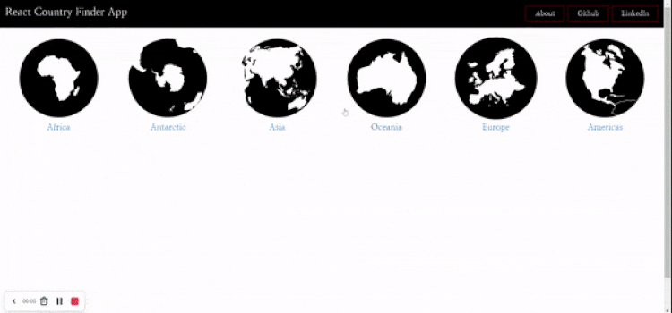

# countryRouterAppReact

## Description

Project aims to create a CountryApp with React-Router.

## Project
https://country-router-app-react-omer-yagci.vercel.app

## Objective
Build a Country Finder App using ReactJS.

## What I used;

Bootstrap 5

Components

useState

useEffect

useParams

useNavigate

array map method

Custom Hooks

Props

RestFull API

useContext

React-Spinner library

